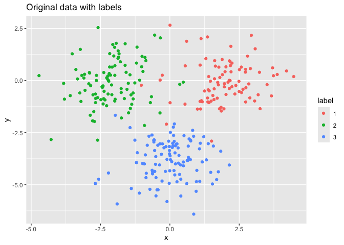
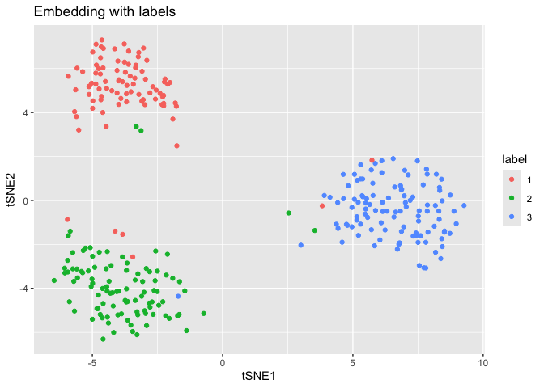
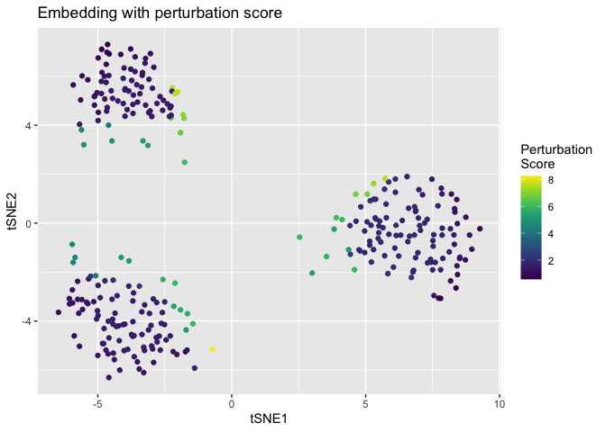
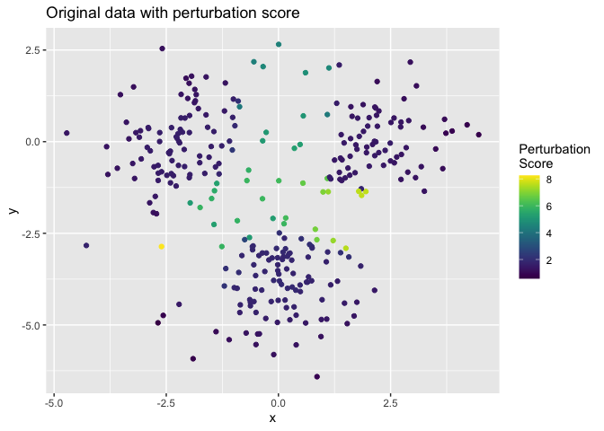
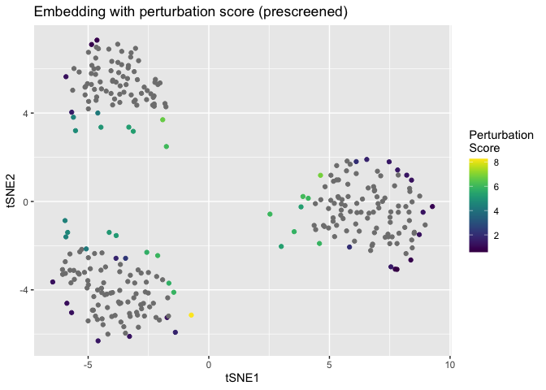
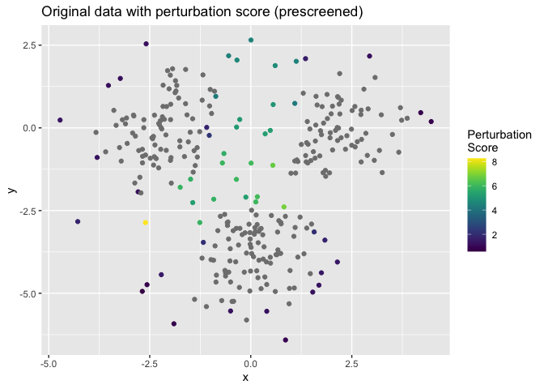
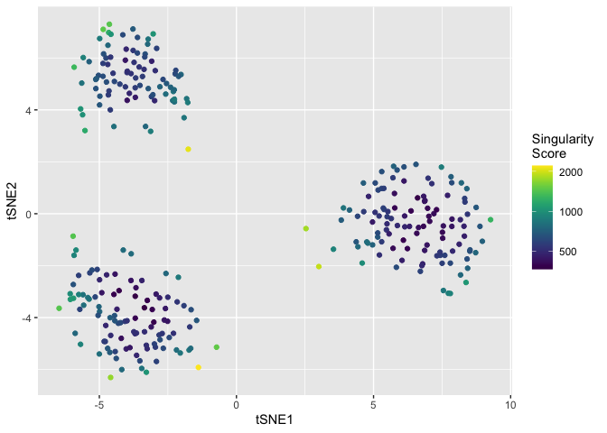
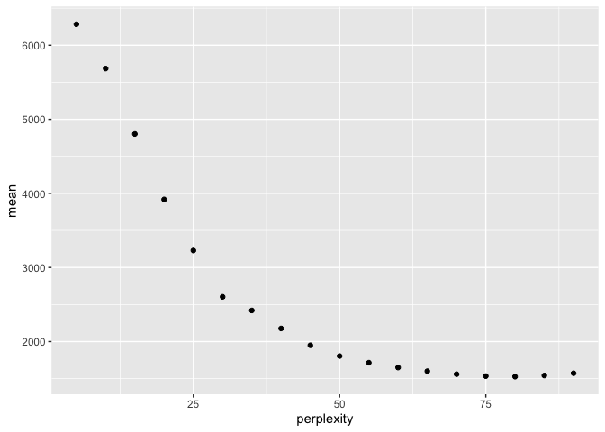

<!-- README.md is generated from README.Rmd. Please edit that file -->

# Map discontinuity based diagnosis for t-SNE

## Installation

To install the package from the github repository, use:

``` r
if(!require(devtools)) install.packages("devtools") # If not already installed
devtools::install_github("zhexuandliu/NE-Reliability-MapContinuity/neMDBD")
#> RtsneWithP (0a663b2c6... -> ff462e945...) [GitHub]
#> 
#> ── R CMD build ─────────────────────────────────────────────────────────────────
#>      checking for file ‘/private/var/folders/l0/vby06rf51fs3v71m749yv3cc0000gn/T/RtmpkhAcJz/remotesb0b43c48969/zhexuandliu-NE-Reliability-MapContinuity-ff462e9/RtsneWithP/DESCRIPTION’ ...  ✔  checking for file ‘/private/var/folders/l0/vby06rf51fs3v71m749yv3cc0000gn/T/RtmpkhAcJz/remotesb0b43c48969/zhexuandliu-NE-Reliability-MapContinuity-ff462e9/RtsneWithP/DESCRIPTION’
#>   ─  preparing ‘RtsneWithP’:
#>      checking DESCRIPTION meta-information ...  ✔  checking DESCRIPTION meta-information
#>   ─  cleaning src
#>   ─  checking for LF line-endings in source and make files and shell scripts
#>   ─  checking for empty or unneeded directories
#>   ─  building ‘RtsneWithP_0.17.tar.gz’
#>      
#> ── R CMD build ─────────────────────────────────────────────────────────────────
#>      checking for file ‘/private/var/folders/l0/vby06rf51fs3v71m749yv3cc0000gn/T/RtmpkhAcJz/remotesb0b426c60209/zhexuandliu-NE-Reliability-MapContinuity-ff462e9/neMDBD/DESCRIPTION’ ...  ✔  checking for file ‘/private/var/folders/l0/vby06rf51fs3v71m749yv3cc0000gn/T/RtmpkhAcJz/remotesb0b426c60209/zhexuandliu-NE-Reliability-MapContinuity-ff462e9/neMDBD/DESCRIPTION’
#>   ─  preparing ‘neMDBD’:
#>      checking DESCRIPTION meta-information ...  ✔  checking DESCRIPTION meta-information
#>   ─  checking for LF line-endings in source and make files and shell scripts
#>   ─  checking for empty or unneeded directories
#>      Omitted ‘LazyData’ from DESCRIPTION
#>   ─  building ‘neMDBD_0.1.0.tar.gz’
#>      
#> 
devtools::install_github("zhexuandliu/NE-Reliability-MapContinuity/RtsneWithP")
```

## Usage

``` r
### load package and calculate embedding

# Load package
library(neMDBD)
library(RtsneWithP)
library(ggplot2)
library(Rfast)

# generate Gaussian mixture data as an example
set.seed(1)
X = MGMM::rGMM(300, d = 2, k = 3, means = list(c(2, 0), c(-2, 0), c(0,-4)), covs = diag(2))
label = factor(rownames(X))

# run t-SNE
perplexity = 75
PCA_x = prcomp(X)
tsne_out = RtsneWithP::Rtsne(X, perplexity = perplexity, theta = 0, 
                 max_iter = 1000, Y_init = PCA_x$x[, 1:2]) # set theta = 0 to run exact tSNE

ggplot() +
  geom_point(data = data.frame(x = X[, 1], y = X[, 2], label = label),aes(x = x, y = y, color = label)) + 
  ggtitle('Original data with labels')
```

<!-- -->

``` r

ggplot() + 
  geom_point(data = data.frame(tSNE1 = tsne_out$Y[, 1], tSNE2 = tsne_out$Y[, 2], label = label),aes(x = tSNE1, y = tSNE2, color = label)) + 
  ggtitle('Embedding with labels')
```

<!-- -->

### Perturbation score

``` r
### calculate perturbation score for all points
# approx = 0 for exact perturbation score, approx = 1 or 2 for acceleration
pscore = perturbation_score_compute(X, tsne_out$Y, perplexity, length = 0.5, approx = 0)
```

``` r
ggplot() +
  geom_point(data = data.frame(tSNE1 = tsne_out$Y[, 1], tSNE2 = tsne_out$Y[, 2], score = pscore),
             aes(x = tSNE1, y = tSNE2, color = score)) +
  viridis::scale_color_viridis(direction = 1, name = "Perturbation\nScore") + 
  ggtitle('Embedding with perturbation score')
```

<!-- -->

``` r

ggplot() +
  geom_point(data = data.frame(x = X[, 1], y = X[, 2], score = pscore),
             aes(x = x, y = y, color = score)) +
  viridis::scale_color_viridis(direction = 1, name = "Perturbation\nScore") + 
  ggtitle('Original data with perturbation score')
```

<!-- -->

``` r
### pre-screening of points on the peripheries using 'dbscan'
ind = which(!dbscan::is.corepoint(tsne_out$Y, eps = 1, minPts = 10))
pscore = rep(NA, dim(X)[1])
pscore[ind] = perturbation_score_compute(X, tsne_out$Y, perplexity, length = 0.5, approx = 2, ind = ind)
```

``` r
ggplot() +
  geom_point(data = data.frame(tSNE1 = tsne_out$Y[, 1], tSNE2 = tsne_out$Y[, 2], score = pscore),
             aes(x = tSNE1, y = tSNE2, color = score)) +
  viridis::scale_color_viridis(direction = 1, name = "Perturbation\nScore") + 
  ggtitle('Embedding with perturbation score (prescreened)')
```

<!-- -->

``` r

ggplot() +
  geom_point(data = data.frame(x = X[, 1], y = X[, 2], score = pscore),
             aes(x = x, y = y, color = score)) +
  viridis::scale_color_viridis(direction = 1, name = "Perturbation\nScore") + 
  ggtitle('Original data with perturbation score (prescreened)')
```

<!-- -->

### Singularity score

First, we should examine the gradient of the t-SNE loss function to
determine if a local minimum has been reached. Small gradient values
indicate convergence to a local minimum.

``` r
### check whether local minimum is reached
gradient_compute(tsne_out$Y, tsne_out$P)[1:10]
#>  [1] -9.002258e-17 -1.692569e-17 -1.887777e-17 -8.305646e-17  1.549520e-17
#>  [6]  1.774534e-18 -4.506946e-17  2.804973e-17  5.381179e-17 -5.280909e-17
```

After reaching the local minimum, we can calculate the singularity score
for fracture-inducing discontinuity diagnosis.

``` r
### calculate singularity score

# compute the singularity score
sscore = singularity_score_compute(tsne_out$Y, tsne_out$P)

# plot singularity score
ggplot() +
  geom_point(data = data.frame(tSNE1 = tsne_out$Y[, 1], tSNE2 = tsne_out$Y[, 2], sscore = sscore), aes(x = tSNE1, y = tSNE2, color = sscore)) +
  viridis::scale_color_viridis(direction = 1, trans = 'log10', name = "Singularity\nScore")
```

<!-- -->

Singularity scores can also guide the selection of perplexity.

``` r
### utilize singularity score to choose perplexity

# calculate the singularity score for each perplexity candidate
perplexity_candidates = c(seq(5,90,5))
sscore_mat= matrix(NA, nrow = dim(X)[1], ncol = length(perplexity_candidates))
for (i in c(1:length(perplexity_candidates))){
  tsne_out_i = RtsneWithP::Rtsne(X, perplexity = perplexity_candidates[i], theta = 0, max_iter = 1000, Y_init = PCA_x$x[, 1:2])
  sscore_mat[,i] = singularity_score_compute(tsne_out_i$Y, tsne_out_i$P)
}

# plot the mean of top 5% singularity score versus perplexity
# choose the elbow point as the perplexity to use
ggplot(data = data.frame(
  mean = apply(sscore_mat, 2, 
               function(s_score) {mean(s_score[s_score > quantile(s_score, 0.95)], na.rm = TRUE)}),
  perplexity = perplexity_candidates
)) +
  geom_point(aes(x = perplexity, y = mean))
```

<!-- -->

# Details

This R package offers functions to calculate singularity score and
perturbation score, to diagnose fracture-inducing and
overconfidence-inducing discontinuities.

# References

\[1\] <https://github.com/jkrijthe/Rtsne>

\[2\] <https://github.com/jdonaldson/rtsne>

\[3\] L.J.P. van der Maaten and G.E. Hinton. “Visualizing
High-Dimensional Data Using t-SNE.” Journal of Machine Learning Research
9(Nov):2579-2605, 2008.
